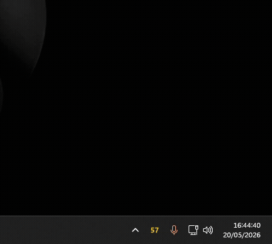

<div align="center">


# Claude Usage Widget

A small Windows system-tray widget that shows your current Claude Code usage (5-hour and 7-day windows) in real time.

<br>



</div>

---

## Requirements

- **Windows 10/11**
- **[Claude Code CLI](https://docs.claude.com/en/docs/claude-code/overview)** installed and signed in (`claude login`). The widget reuses the OAuth credentials that the CLI stores at `~/.claude/.credentials.json`.
- To run from source (developers): **Python 3.10+**.

---

## Installation

There are two ways to install it: use the pre-built `.exe` (recommended) or run it from source.

### Option A — Installer / `.exe` (recommended)

1. Download the latest version from the [installer](https://cdn.jagoba.dev/downloads/claude-usage-widget/ClaudeUsageWidget-Setup-1.0.3.exe).
2. Run the installer (`ClaudeUsageWidget-Setup-x.y.z.exe`).
3. The widget will appear in the system tray. Left-click opens the popup with the details, right-click shows the menu (refresh / quit).
4. **(Highly recommended)** Pull the icon out of the tray overflow flyout (`^`) so it is always visible on the taskbar. Once the widget has run at least once, open **PowerShell** and run:

    ```powershell
    irm https://raw.githubusercontent.com/jagobainda/claude-usage-widget/main/scripts/promote-tray-icon.ps1 | iex
    ```

    The script tweaks the Windows registry (`HKCU\Control Panel\NotifyIconSettings`) to pin the icon and restarts Explorer to apply the change. You can review the full source at [`scripts/promote-tray-icon.ps1`](scripts/promote-tray-icon.ps1) before running it.

> The executable is digitally signed. The first time you open it, Windows SmartScreen may take a few seconds to validate it.

### Option B — From source (recommended for developers only)

```powershell
git clone https://github.com/jagobainda/claude-usage-widget.git
cd claude-usage-widget

python -m venv .venv
.\.venv\Scripts\Activate.ps1

pip install -r requirements.txt
python main.py
```

---

## Build your own `.exe`

The repository includes a PowerShell script that automates the build with PyInstaller:

```powershell
.\scripts\build-release.ps1 -Version "1.0.0"
```

The resulting binary is dropped at `releases\ClaudeUsageWidget-1.0.0.exe`.

If you have a code-signing certificate (e.g. Certum), you can sign it in the same step:

```powershell
.\scripts\build-release.ps1 -Version "1.0.0" -Sign -CertThumbprint "<sha1>"
```

---

## Auto-start with Windows (optional)

To have the widget start with your session:

1. Press `Win + R`, type `shell:startup` and hit Enter.
2. Create a shortcut to `ClaudeUsageWidget.exe` inside that folder.

---

## Uninstall

- If you used the **installer**: uninstall it from _Installed apps_ in Windows.
- If you used the **portable `.exe`** or the **source code**: close the widget from the tray menu and delete the folder.

Your Claude Code credentials are not touched during uninstall — they still live in `~/.claude/.credentials.json` and are managed by the official CLI.

---

> [!WARNING]
>
> The widget queries the endpoint that the official Claude Code CLI uses internally to display usage. **It is a private, undocumented endpoint** — Anthropic may change it, restrict it, or remove it at any time without notice. If that happens, the widget will stop working until an update is released, and that update may take some time.

## License

Distributed under the terms of the [LICENSE.txt](LICENSE.txt) file.
